Example code for dynamical mean-field theory (DMFT) calculation using the [NRG
Ljubljana](https://github.com/rokzitko/nrgljubljana) code as
the impurity solver

Model: Kondo lattice model (KLM), S=1/2; model description in template/.

Features:
- use of templates (i.e., Mathematica is not required at run time)
- improved NRG discretization scheme (Zitko, Pruschke, 2008)
- improved estimator for the self-energy (Kugel, 2022)
- support for arbitrary density of states (tabulated in file DOS.dat)
- safeguarded band occupancy control with frozen-self-energy lattice evaluation
- linear or Broyden mixing of the hybridization spectral density
- adaptive grid for better capturing sharp spectral features
- transport calculation using external [bubble](https://github.com/rokzitko/bubble) code

Requirements:
- NRG Ljubljana 2026.09 at commit `b3a800e0` or later, including the associated tools (`hilb`, `kk`,
  `integ`, `adapt`, `nrgchain`, `broaden`, `resample`, `matrix`, `diag`,
  `unitary`)
- associated scripts (getparam, scaley, getiter, newiter, subtracty...), in github repo rokzitko/nrgljubljana under scripts/.
- perl
- Python 3 with NumPy, SciPy, and Matplotlib for support and plotting
  scripts
- m4 macro processor
- Bubble 1.14 or later for transport and lattice-DOS postprocessing (optional
  for the core DMFT loop)

Two modes of operation:
- local: a script named "mynrgrun" must exist; a minimal version just calls "nrg", but typically you will want to set up
  the environment (number of threads, working directory, piping of output to files); an example is provided
- slurm: a script named "subslurm" must exist to create a job script and submit it to the cluster for execution

# Testing

The fast test suite uses deterministic stubs for external numerical programs and
does not run NRG. It requires Python with NumPy and SciPy:

```sh
DMFT_TEST_EXTERNAL=0 PYTHONDONTWRITEBYTECODE=1 prove -v code/tests/*.t
```

The numerical integration tests exercise the installed NRG Ljubljana and Bubble
tools. Setting `DMFT_TEST_EXTERNAL=1` makes a missing required executable a test
failure instead of a skip:

```sh
DMFT_TEST_EXTERNAL=1 PYTHONDONTWRITEBYTECODE=1 prove -v code/tests/numerics.t
```

If `DMFT_TEST_EXTERNAL` is omitted, each external-tool subtest runs when all of
its required executables are available and otherwise skips. Full DMFT/NRG
calculations are intentionally outside the fast suite. A reduced particle-hole
symmetric calculation with two z shifts and exactly two DMFT cycles runs nightly
and on manual dispatch through `.github/workflows/nightly-real-nrg.yml`. With a
local NRG Ljubljana installation, invoke the same fixture directly:

```sh
code/tests/real_nrg/run
```

Rok Zitko, 2026

# Reference calculation

The figures below summarize the converged reference solution in
`reference_results/`.  It is a doped Kondo lattice on the Bethe lattice, with
the following parameters:

| Quantity | Value |
|---|---|
| Bare density of states | Semicircular, with half-bandwidth $D=1$ |
| Localized moment | $S=1/2$ |
| Couplings | $J_K=0.4$, $U=0$, $B=0$ |
| Temperature | $T=0.01$ |
| Conduction-band filling | $n=0.8$ |
| Chemical potential | $\mu=-0.19660824$ |
| NRG discretization | $\Lambda=2$, $N_z=4$ |

All energies are measured in units of $D$, and one-particle spectral
functions are given per conduction-electron spin.  The transport quantities
use the dimensionless normalization defined in [Bubble and conductivity
normalization](#bubble-and-conductivity-normalization); they are not SI
conductivities.  Each displayed image links to the corresponding PDF figure.

## One-particle spectra and effective medium

### Hybridization function

[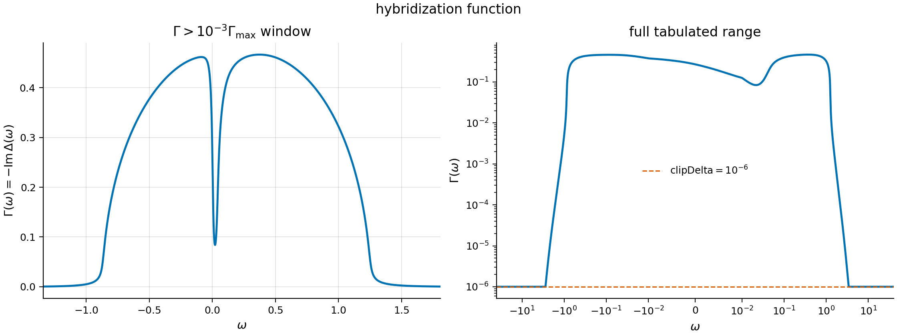](reference_results/plots/02_hybridization.pdf)

The converged bath spectrum
$\Gamma_\Delta(\omega)=-\mathrm{Im}\Delta^R(\omega)$ has a narrow,
asymmetric depletion near the Fermi level.  For the semicircular Bethe lattice
this structure is directly tied to the local propagator through
$\Delta^R=G_{\mathrm{loc}}^R/4$.  The dashed line in the right panel is the
numerical floor $10^{-6}$; it is not a physical scattering scale.

### Local spectral function

[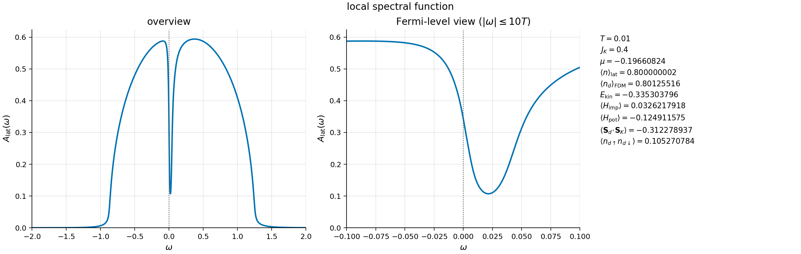](reference_results/plots/05_local_spectral_function.pdf)

The local spectrum has a pronounced pseudogap-like minimum slightly above the
Fermi level.  Its displacement from $\omega=0$ reflects the particle-hole
asymmetry at filling $n=0.8$.  The expectation value
$\langle\mathbf S_d\mathbin{\cdot}\mathbf S_K\rangle=-0.3123$ signals strong
antiferromagnetic Kondo correlations,
while the lattice filling agrees with its target to the displayed precision.

### Self-energy over the full band

[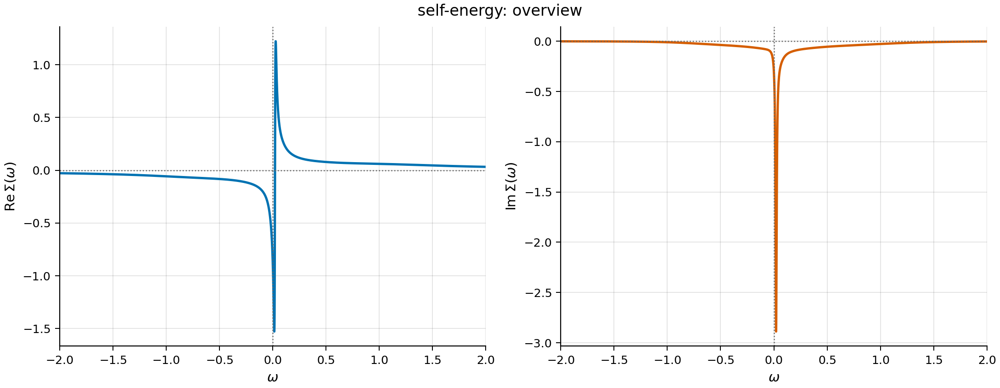](reference_results/plots/06_self_energy_overview.pdf)

Both components of the retarded self-energy show a sharp low-energy
resonance, with $\mathrm{Im}\Sigma^R\leq 0$ as required by causality.
The associated strong dispersion of $\mathrm{Re}\Sigma^R$ and peak in
$-\mathrm{Im}\Sigma^R$ produce the narrow depletion in the local
spectrum and reconstruct the band near the Fermi level.

### Low-frequency self-energy

[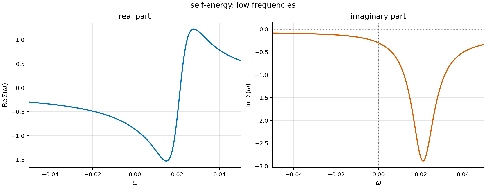](reference_results/plots/07_self_energy_low_frequency.pdf)

On the thermal scale, the self-energy resonance is centered near
$\omega=0.02$, rather than at the Fermi level.  This low-frequency view makes
the particle-hole asymmetry and the relation between the dispersive and
absorptive parts of the resonance explicit.

### Band-energy-resolved spectrum

[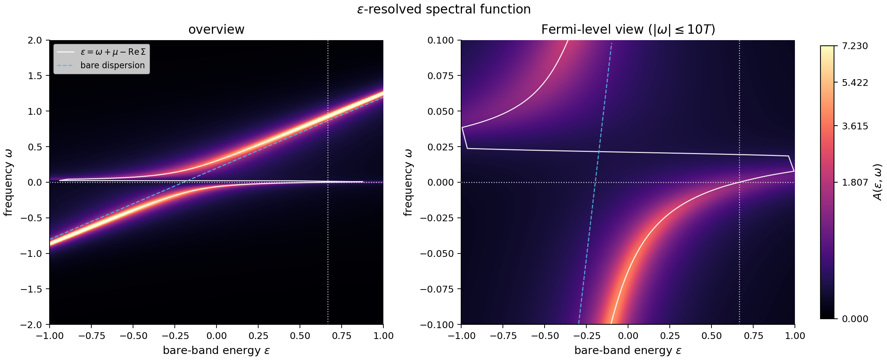](reference_results/plots/10_epsilon_resolved_spectrum.pdf)

The intensity map shows
$A_\epsilon(\omega)=-\mathrm{Im}G_\epsilon^R(\omega)/\pi$.  The solid
white curve follows
$\epsilon=\omega+\mu-\mathrm{Re}\Sigma^R(\omega)$, while the dashed line
is the bare dispersion.  Their strong separation and the bending of the
spectral ridges near the Fermi level display the interaction-induced
reconstruction of the conduction band.  The dotted lines mark $\omega=0$ and
$\epsilon_F=\mu-\mathrm{Re}\Sigma^R(0)$.

### Complex effective medium

[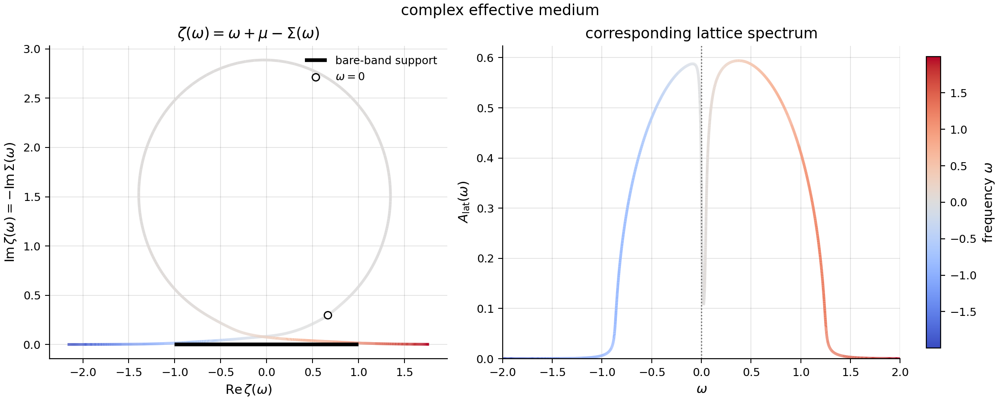](reference_results/plots/11_effective_medium.pdf)

The trajectory
$\zeta(\omega)=\omega+\mu-\Sigma^R(\omega)$ gives the complex argument at
which the bare Hilbert transform is evaluated.  The black segment denotes the
support of the bare band.  The large excursion into the upper half-plane near
the self-energy resonance corresponds to the low-energy loss of spectral
weight shown in the right panel; color labels the fermionic frequency.

## Optical response

### Optical conductivity

[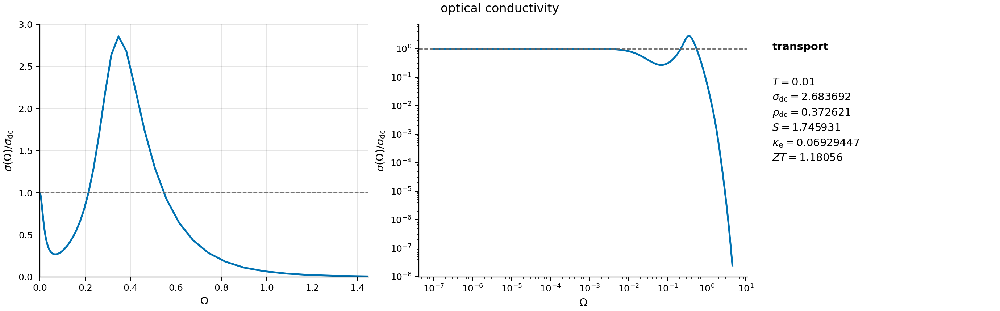](reference_results/plots/04_optical_conductivity.pdf)

Relative to the dc value, the low-frequency response is suppressed and
spectral weight is transferred to a broad maximum near $\Omega=0.35$.  This
finite-frequency structure is consistent with transitions between the
reconstructed low-energy branches.  The displayed dc and thermoelectric
quantities follow the dimensionless conventions stated below.

### Optical sum rule

[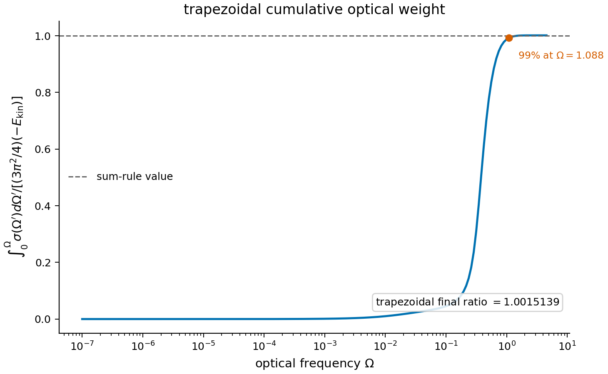](reference_results/plots/12_optical_sum_rule.pdf)

The cumulative optical weight is normalized by the Bethe-lattice sum-rule
value $(3\pi^2/4)(-E_{\mathrm{kin}})$.  It reaches 99 percent of this value by
$\Omega=1.088$; the final trapezoidal ratio is $1.0015139$, an agreement at
about the $1.5\times 10^{-3}$ level.  The more accurate quadrature used for
the numerical sum-rule diagnostic is described in [Optical f-sum
rule](#optical-f-sum-rule).

## Bare band and NRG discretization

### Density of states and transport function

[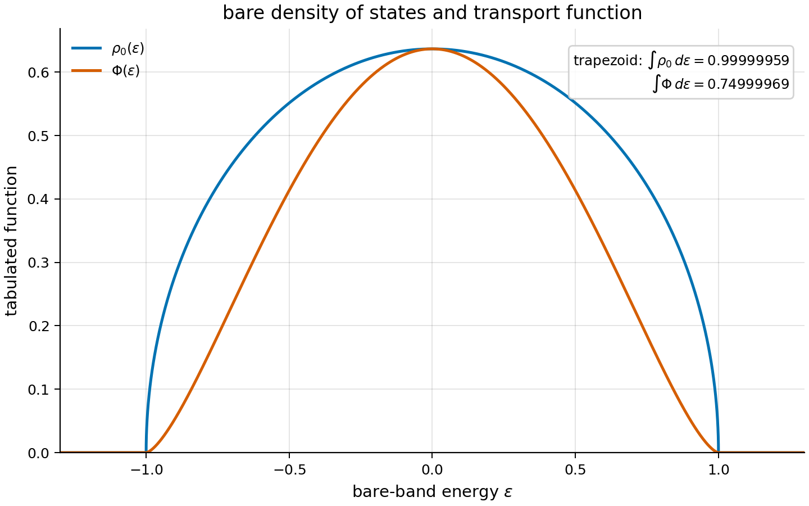](reference_results/plots/09_bare_dos_transport.pdf)

The semicircular density of states is normalized to one per spin.  The Bethe
transport function obeys
$\Phi(\epsilon)=(1-\epsilon^2)\rho_0(\epsilon)$ for $D=1$, with
$\int d\epsilon\,\Phi(\epsilon)=3/4$.  The values printed in the figure show
the accuracy with which these continuum normalizations are represented.

### Improved discretization functions

[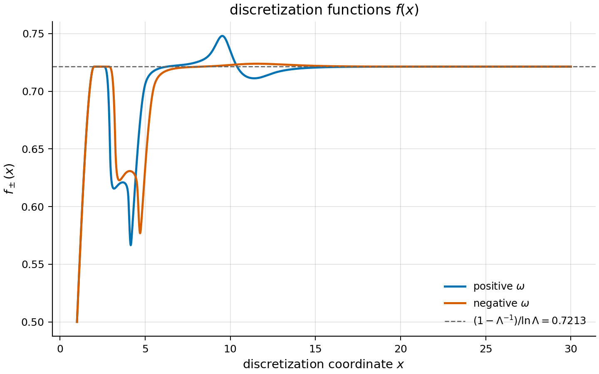](reference_results/plots/03_discretization_functions.pdf)

The functions $f_+(x)$ and $f_-(x)$ adapt the logarithmic NRG intervals to the
asymmetric hybridization spectrum.  Their deviations from the large-$x$
limit occur where the bath varies most rapidly.  Both branches approach
$(1-\Lambda^{-1})/\ln\Lambda=0.7213$, as required once the bath becomes
locally featureless on a logarithmic scale.

### Frequency resolution

[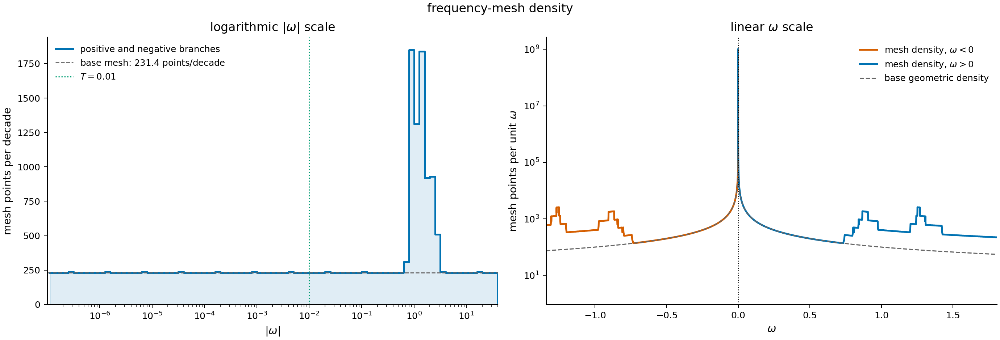](reference_results/plots/08_mesh_density.pdf)

The real-frequency mesh retains the underlying geometric resolution of about
231 points per decade while placing additional points near rapid spectral
variation and the band edges.  Around the Fermi level it preserves
logarithmic resolution on scales well below $T=0.01$; on a linear scale the
enhanced resolution follows the structure of the bath rather than a uniform
spacing.

## Convergence and spectral consistency

### DMFT convergence

[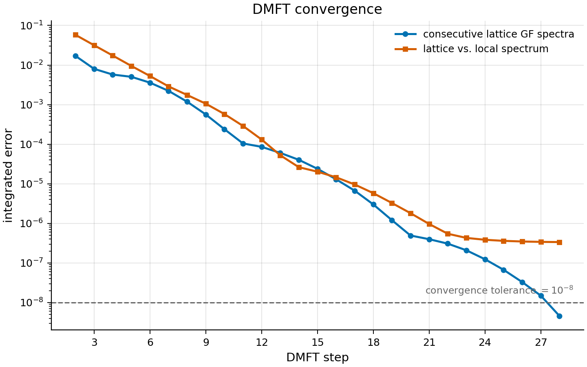](reference_results/plots/01_convergence.pdf)

The integrated difference between consecutive lattice Green-function spectra
falls below $10^{-8}$ at the final DMFT step.  The lattice-versus-local norm is
a separate self-consistency measure and saturates at a few times $10^{-7}$; the
pointwise and integrated residuals are resolved in the spectral-closure
figure below.

### Spectral closure

[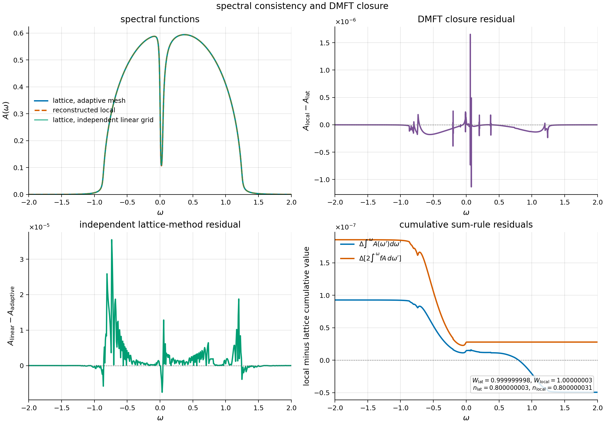](reference_results/plots/13_spectral_closure.pdf)

The lattice spectrum, the impurity spectrum reconstructed from the Dyson
equation, and an independent lattice evaluation are indistinguishable on the
scale of the upper-left panel.  Pointwise differences remain of order
$10^{-6}$ for DMFT closure and a few $10^{-5}$ for the independent frequency
mesh.  The total spectral weights and fillings obtained from the local and
lattice spectra agree within a few $10^{-8}$.

# Conventions

This document defines the normalization and sign conventions used by this
repository.  The formulas describe the current unpolarized, single-channel
implementation.  In particular, transport outputs are dimensionless
code-normalized quantities.  They are not conductivities in SI units.

## Units and energy variables

- The half-bandwidth is denoted by `D` and is set to `D = 1`.
- The full bandwidth is therefore `2D = 2`.
- Literature that denotes the Bethe half-bandwidth by `W`, including
  Arsenault and Tremblay, has `W = D` in this document; `W` is not the full
  bandwidth here.
- `k_B = hbar = 1`.
- Temperature, fermionic frequency, optical frequency, chemical potential,
  self-energy, hybridization, interaction strengths, and kinetic energy are
  all expressed in units of `D`.
- Before setting `D = 1`, densities of states and spectral functions have
  units `1/D`.  Their tabulated values are numerical values in the `D = 1`
  system.
- `omega` is a fermionic frequency measured relative to the chemical
  potential, so the Fermi function is

  ```math
  f(\omega)=\frac{1}{1+\exp(\omega/T)}.
  ```

- `Omega` is the external bosonic frequency used for optical conductivity.
  It is distinct from the internal integration frequency `omega`.
- `epsilon` denotes a bare band energy relative to the center of `DOS.dat`.

The NRG parameter `bandrescale` is an internal solver rescaling and is not the
physical bandwidth.  With `data_has_rescaled_energies=false`, output energies
are in the physical `D = 1` convention above.

Under the usual infinite-coordination Bethe-lattice notation, in which the
scaled hopping is `t_*` and `D = 2 t_*`, this repository has

```math
t_*=\frac12, \qquad t_*^2=\frac14.
```

This hopping convention is inferred from the semicircular DOS; the repository
does not define a finite-coordination bond hopping.

## Model and spin convention

In energy representation, the grand-canonical lattice Hamiltonian represented
by the impurity problem is

```math
K = \sum_{k\sigma}
  (\epsilon_k-\mu)c^\dagger_{k\sigma}c_{k\sigma}
  + U\sum_i n_{i\uparrow}n_{i\downarrow}
  + J_K\sum_i \mathbf S_i\mathbin{\cdot}\mathbf s_i
  + B\sum_i(S_i^z+s_i^z).
```

Here

```math
\mathbf S\mathbin{\cdot}\mathbf s
=S^zs^z+\frac12(S^+s^-+S^-s^+).
```

Important details are:

- There is one conduction channel with two spin components.
- The default localized spin is `S = 1/2`.
- `J_K > 0` is antiferromagnetic: the local singlet has exchange energy
  `-3 J_K/4` and the triplet has `J_K/4`.
- The optional `U` acts on the conduction orbital.  The default is `U = 0`.
- The field term has the sign `+B(S^z+s^z)`, rather than the frequently used
  `-B(S^z+s^z)` convention.
- `Himp` in the expectation-value output is grand canonical because it
  contains `-mu n`.
- `Hpot` contains only `U n_up n_down + J_K S.s`; it excludes the level,
  chemical-potential, and field terms.

The current DMFT and transport pipeline uses one scalar, spin-averaged
self-energy and `QS` symmetry.  Its supported convention is therefore the
unpolarized `B = 0` case.  The parameter `spin=1/2` refers to the localized
Kondo spin and is unrelated to factors of two from conduction-electron spin.

Unless explicitly stated otherwise:

- `DOS.dat`, one-particle Green functions, and spectral functions are per
  conduction-electron spin.
- The filling `n` is summed over the two conduction-electron spins and ranges
  from zero to two.
- `n_d` is the total two-spin occupancy.
- `n_d_ud` is the double occupancy.
- `ekin.dat` is spin-summed.
- The transport bubbles contain one spin copy and no explicit spin sum.

## Retarded Green functions

The retarded convention is

```math
G^R_{AB}(t)=-i\theta(t)\langle\{A(t),B(0)\}\rangle,
\qquad
G^R_{AB}(\omega)=\int_{-\infty}^{\infty}dt\,
e^{i\omega t}G^R_{AB}(t).
```

The band-energy-resolved lattice Green function is

```math
G^R_\epsilon(\omega)=
\frac{1}{
  \omega+\mu-\epsilon-\Sigma^R(\omega)
}.
```

The local Green function and spectral function are

```math
G^R_{\mathrm{loc}}(\omega)
=\int d\epsilon\,\rho_0(\epsilon)G^R_\epsilon(\omega),
\qquad
A(\omega)=-\frac{1}{\pi}\mathrm{Im}\,G^R(\omega).
```

Thus `Im Sigma^R <= 0`, `Im Delta^R <= 0`, and a normalized one-particle
spectral function obeys

```math
\int_{-\infty}^{\infty}d\omega\,A(\omega)=1
```

per spin.

The reconstructed impurity propagator is

```math
G^R_{\mathrm{imp}}(\omega)=
\frac{1}{
  \omega+\mu-\Delta^R(\omega)-\Sigma^R(\omega)
}.
```

The improved self-energy estimator uses the auxiliary retarded correlators
`F` and `I`:

```math
\Sigma^R(\omega)=\Sigma_H+I^R(\omega)
-\frac{[F^R(\omega)]^2}{G^R(\omega)}.
```

`Sigma_H` and the self-energy are averaged over up and down spins before they
enter the scalar DMFT loop.

## Bethe density of states

For a general half-bandwidth `D`, the normalized semicircular DOS is

```math
\rho_0(\epsilon)=
\frac{2}{\pi D^2}\sqrt{D^2-\epsilon^2}\,
\Theta(D-|\epsilon|).
```

With `D = 1`, as generated by `code/mkDOS`,

```math
\rho_0(\epsilon)=
\frac{2}{\pi}\sqrt{1-\epsilon^2}\,
\Theta(1-|\epsilon|).
```

Its normalization is per spin:

```math
\int d\epsilon\,\rho_0(\epsilon)=1,
\qquad
\int d\epsilon\,\epsilon^2\rho_0(\epsilon)=\frac14.
```

For this DOS, the Bethe DMFT self-consistency relation may be written

```math
\Delta^R(\omega)=t_*^2G^R_{\mathrm{loc}}(\omega)
=\frac14G^R_{\mathrm{loc}}(\omega).
```

The implementation evaluates the more general Hilbert transforms of the
tabulated `DOS.dat`. With

```math
G(z)=H_0(z),\qquad F(z)=H_1(z),
```

the normalized-DOS identity `H_1(z)=zH_0(z)-1` gives the stable update

```math
\Delta^R(z)=\frac{F(z)}{G(z)}.
```

Only the spectral part of this raw complex update enters the iterative state:

```math
\Gamma_\Delta(\omega)=-\mathrm{Im}\Delta^R(\omega)\geq 0.
```

`Delta.dat` stores `Gamma_Delta` directly, with no factor of `1/pi`. Its
Lehmann density is therefore `Gamma_Delta/pi`. After remeshing and mixing, the
complex hybridization is reconstructed from this one authoritative table:

```math
\begin{aligned}
\mathrm{Im}\Delta^R(\omega)&=-\Gamma_\Delta(\omega),\\
\mathrm{Re}\Delta^R(\omega)&=\texttt{param.eps}
+\frac{1}{\pi}\,\mathcal P\!\int dE\,
\frac{\Gamma_\Delta(E)}{\omega-E}.
\end{aligned}
```

The implementation obtains the dynamic real part by running Steffen `kk` on
`ImDelta=-Gamma`; running it on positive Gamma would reverse the sign. Linear
and Broyden mixing both operate on Gamma alone. Projection and reconstruction
occur only after the mixed result has been formed, so `ReDelta` and `ImDelta`
cannot drift independently. `param.eps` must contain the first moment of the
normalized bare `DOS.dat`; it is zero for the checked-in particle-hole
symmetric Bethe DOS.

If a multi-step Broyden proposal contains a negative interior Gamma value, the
accelerated proposal is discarded and that cycle uses the ordinary linear step.
The subsequent strict causal projection still rejects the cycle if this fallback
is materially negative or has non-negligible endpoint tails.

NRG Ljubljana materializes the selected Steffen interpolant as interval
polynomials and integrates both transforms analytically. Thus `H_0` and `H_1`
use exactly the same represented DOS and satisfy their moment identity up to
floating-point rounding.

## Numerical file conventions

Several historical filenames use `im` and `re` for quantities that have
already been multiplied by `-1/pi`.  The distinction is important.

| File | Second column |
|---|---|
| `DOS.dat` | Bare `rho_0(epsilon)`, normalized per spin |
| `PHI.dat` | Code-normalized transport function `Phi(epsilon)` |
| `c-imG.dat`, `imaw.dat` | `-Im G^R/pi = A`, not `Im G^R` |
| `c-reG.dat`, `reaw.dat` | `-Re G^R/pi`, not `Re G^R` |
| `c-imF.dat`, `c-imI.dat` | `-Im F^R/pi`, `-Im I^R/pi` |
| `c-reF.dat`, `c-reI.dat` | `-Re F^R/pi`, `-Re I^R/pi` |
| `imsigma.dat`, `resigma.dat` | Actual `Im Sigma^R`, `Re Sigma^R` |
| `Delta.used.dat`, `Delta.next.dat` | Authoritative `Gamma_Delta=-Im Delta^R >= 0` NRG inputs |
| `ImDelta.used.dat`, `ImDelta.next.dat` | Derived `-Gamma_Delta` on the same mesh |
| `ReDelta.used.dat`, `ReDelta.next.dat` | Derived Steffen KK transform plus `param.eps` |
| `self.dat` | Reconstructed impurity spectral function, not the self-energy |
| `ldos.dat` | Interacting local DOS written by `bubble`; distinct from uppercase `DOS.dat` |
| `cond.opt-PHI.dat` | `Omega`, `sigma_code(Omega)` |
| `ekin.dat` | Spin-summed kinetic-energy scalar |

`param.mu.used` and `mesh.used.dat` belong to the current result batch, while
`param.mu.next` and `mesh.next.dat` are inputs for the next cycle. The legacy
names `ReDelta.dat`, `ImDelta.dat`, `Delta.dat`, `param.mu`, and `mesh.dat` are
compatibility symlinks to their respective next-cycle files. `res/` exists only
while a completed cycle is being staged and is removed after successful
publication.

## Occupancy control

`occupancy_mode=accurate` is the production default. For each trial chemical
potential, `occupancy_control` keeps the current `resigma.dat` and
`imsigma.dat` fixed and asks `bandDOS` to recompute the lattice Green function.
The final trial's `H_0` pair and a Sigma/DOS provenance marker are reused by
`dmftDOS-stable`, so the subsequent raw DMFT update computes only `H_1`. Set
`occupancy_mode=fast` to use the less
expensive rigid-spectrum approximation
`A_trial(omega)=A_used(omega+mu_trial-mu_used)`; it shifts only the frequency
column and never extrapolates the spectrum.

Both modes integrate the represented Steffen spectrum with the external
`integ` tool, require its total weight to agree with one within
`occupancy_weight_tol`, bracket the filling root inside the step-relevant
interval, and cap all trial evaluations with `occupancy_maxeval`. A standard
update applies `under*(mu_root-mu_used)` and then enforces `maxdx`. Failed
validation or root solving does not replace the staged chemical potential,
log, or metrics.

`occupancy.log` remains the four-column compatibility log
`mu_used mu_next dx n_used`. `OCCUPANCY_METRICS` is the detailed, per-cycle
key/value record. Convergence requires the consecutive-spectrum criterion,
`abs(error_old)<=occupancy_solve_tol`, and
`abs(convergence_dx)<=occupancy_mu_tol`. During active Broyden control,
measure-only mode performs no trial Hilbert transforms and uses the previously
applied Broyden step for `convergence_dx`.

The spectral criterion uses the largest `DIFFS_C` value in the last
`convwindow` consecutive iterations. The history must end at the current
iteration and malformed, non-finite, negative, duplicate, or gapped rows are
fatal. `miniter` is the first iteration eligible for convergence and `maxiter`
is the last permitted iteration; both limits are inclusive. A converged result
at `maxiter` takes precedence over the iteration limit.

Mesh files have two columns for compatibility, but their second column is ignored.

`dmft_done` writes `res/READY` only after the completed result batch and the
next-cycle inputs have been validated. Publication is deliberately repeatable:
the root files are recopied, then `ITER` and `CONVERGED`/`STOP` are written
last. If publication is interrupted, rerunning `START` or
`scripts/dmft_done --publish` completes it from `res/`. This is a portable
recovery protocol rather than a multi-file atomic transaction, and concurrent
writers in one calculation directory are not supported. It uses ordinary
relative symlinks and repeatable file copies, without locks or Linux-specific
filesystem operations. A persistent `res/`
directory made by an older version is migrated automatically on the next
`START`. For a restart, `Delta.next.dat`, `param.eps`, and `param.mu.next` are
the irreducible inputs. Derived Re/Im files are rebuilt. When no Gamma table is
available, a legacy ImDelta table can be converted once; a legacy independent
ReDelta table is never treated as authoritative.
It is zero on a freshly generated mesh but can contain copied hybridization
values after a restart.  Most other numerical tables are whitespace-separated
and have no header.

`DOS.dat` and `PHI.dat` are strictly increasing, real, two-column tables on an
identical 2,601-point mesh. Inside the band, the Python generators use 2,001
uniform values of `theta` with `epsilon=sin(theta)`. This clusters points near
the square-root band edges without increasing the table size. The endpoints
are forced to exact `epsilon=+-1` with zero value; 300 exact-zero padding
points are retained on each side out to `+-1.3`.

`mkDOS` normalizes the Steffen interval-polynomial representation using the
analytic integral reported by `hilb` and publishes only after that result has
been verified. `mkPHI` reads the normalized `DOS.dat` and evaluates
`Phi=(1-epsilon^2)rho_0` on exactly the same knots.

`START` validates bare tables before every cycle with
`scripts/validate_bare_inputs`. The validator uses `integ` with Steffen
interpolation, requires the represented `DOS.dat` weight to equal one within
`1e-8`, and requires `param.eps` to equal its normalized first moment within
`1e-10` times the band-energy scale. If `PHI.dat` is present, it must be a
finite, nonnegative table on the same mesh and have positive represented
weight. Blank and whole-line `#` comments are permitted. Core DMFT permits an
absent `PHI.dat`; transport postprocessing requires it. The same check can be
run directly before starting a calculation:

```sh
scripts/validate_bare_inputs
```

## Bethe transport function

Before setting `D = 1`, the dimensionless kernel corresponding to the
code-normalized longitudinal transport function is

```math
\Phi(\epsilon)
=\frac{D^2-\epsilon^2}{D}\rho_0(\epsilon).
```

For `D = 1`, the continuum transport function is

```math
\Phi(\epsilon)=
\frac{2}{\pi}(1-\epsilon^2)^{3/2}\,
\Theta(1-|\epsilon|).
```

The generators apply the same roundoff-scale normalization correction to both
tables, so the printed `PHI.dat` values can differ from this closed form by one
common factor while preserving `Phi=(1-epsilon^2)rho_0` at every knot. The
continuum identities needed for the sum rule are

```math
\Phi(\epsilon)=(1-\epsilon^2)\rho_0(\epsilon),
\qquad
\Phi'(\epsilon)=-3\epsilon\rho_0(\epsilon),
\qquad
\int d\epsilon\,\Phi(\epsilon)=\frac34.
```

This is not the directional normalization used by Arsenault and Tremblay.  In
their convention for a Bethe lattice with `D = 1`,

```math
\Phi_{xx}^{\mathrm{AT}}(\epsilon)
=\frac{1}{3d}(1-\epsilon^2)\rho_0(\epsilon),
```

and hence

```math
\Phi(\epsilon)=3d\,\Phi_{xx}^{\mathrm{AT}}(\epsilon).
```

Here `d` is the formal dimension/current-direction normalization in the
Arsenault-Tremblay Bethe prescription.  It is not a physical dimension or a
parameter used by this repository.

The code has absorbed the directional `1/d` and the additional `1/3` into its
conductivity normalization.  This is natural for a Bethe lattice, which has no
ordinary crystal momentum or uniquely normalized Cartesian current, but it
means that `Phi` must not be mistaken for a physical velocity-squared DOS.

The built-in `bubble` kernel `m=5` is only
`(1-epsilon^2)^(3/2)` and does not contain `2/pi`.  Therefore the two wrappers
use equivalent prefactors:

```math
\begin{aligned}
\texttt{bbl}:&\quad (2/\pi)\pi^2=2\pi, \\[0pt]
\texttt{bbl-PHI}:&\quad \pi^2,
\end{aligned}
```

because the latter obtains `2/pi` from `PHI.dat`.

## Bubble and conductivity normalization

For `D = 1`, define

```math
A_\epsilon(\omega)=-\frac{1}{\pi}
\mathrm{Im}\,G^R_\epsilon(\omega).
```

For `Omega > 0`, the raw finite-frequency result returned by `bubble` with a
tabulated kernel and `n=2`, `o=0` is

```math
B(\Omega)=
\int d\epsilon\,\Phi(\epsilon)
\int d\omega\,
\frac{f(\omega)-f(\omega+\Omega)}{\Omega}
A_\epsilon(\omega)A_\epsilon(\omega+\Omega).
```

At `Omega = 0`, `bubble` uses the corresponding `-df/domega` limit directly.

There is no explicit charge, spin sum, lattice spacing, volume, direction, or
velocity prefactor in `B`.  `code/scripts/cond.opt-PHI` and
`code/scripts/bbl-PHI` define

```math
\boxed{\sigma_{\mathrm{code}}(\Omega)=\pi^2B(\Omega)}.
```

The `pi^2` converts the two normalized spectral functions
`A=-Im G/pi` to the historical convention in which the integrand contains two
factors of `-Im G`.

For comparison, the regular absorptive part in the usual Kubo convention is

```math
\mathrm{Re}\,\sigma_{xx}^{\mathrm{Kubo,reg}}(\Omega)
=\pi e^2\sum_\sigma
\int d\epsilon\,\Phi_{xx}(\epsilon)
\int d\omega\,
\frac{f(\omega)-f(\omega+\Omega)}{\Omega}
A_{\epsilon\sigma}(\omega)A_{\epsilon\sigma}(\omega+\Omega).
```

This spectral-product expression is for `Omega > 0`; it is not the full
complex conductivity and does not display a possible zero-frequency Drude
distribution.

For two degenerate spins and the Arsenault-Tremblay `Phi_xx`, this gives the
purely algebraic relation

```math
\sigma_{\mathrm{code}}
=\frac{3\pi d}{2e^2}\,
\mathrm{Re}\,\sigma_{xx}^{\mathrm{Kubo,reg}},
```

before restoring lattice-spacing and volume factors.  This comparison explains
the normalization, but does not define an SI conversion for the Bethe lattice.

Files named `condMIR.dat` and `rhoMIR.dat` are therefore best read as
dimensionless code-normalized conductivity and its reciprocal.  This
repository does not define `sigma_MIR`, `e`, a lattice spacing, a unit-cell
volume, or an SI restoration factor.

`bubble` evaluates the one-particle bubble with a local scalar self-energy.  It
does not add vertex corrections, a separate diamagnetic term, or a separate
Drude delta function.  The finite-frequency result is the regular absorptive
bubble contribution.  In the infinite-dimensional one-band setting the
longitudinal vertex corrections normally vanish, but this remains part of the
model assumption.

## Kinetic energy

Define the band-energy occupation per spin by

```math
n_\epsilon=\int d\omega\,f(\omega)A_\epsilon(\omega).
```

`code/scripts/ekin` uses `bubble -f`, the kernel
`epsilon rho_0(epsilon)`, and one spectral function.  `bubble` therefore first
computes the one-spin quantity

```math
K_\uparrow=\int d\epsilon\,\epsilon\rho_0(\epsilon)n_\epsilon.
```

The script then explicitly multiplies it by two:

```math
\boxed{E_{\mathrm{kin}}
=2\int d\epsilon\,\epsilon\rho_0(\epsilon)n_\epsilon}.
```

`E_kin` is the conduction-band kinetic energy per DOS-normalized lattice site,
summed over the two spins.  It excludes the grand-canonical `-mu n` term,
the Hubbard interaction, and the Kondo exchange.

## Optical f-sum rule

For one spin, a local causal self-energy, and complete frequency integrals, the
full-frequency bubble identity is

```math
\int_{-\infty}^{\infty}d\Omega\,B(\Omega)
=-\int_{\epsilon_-}^{\epsilon_+}d\epsilon\,
\Phi(\epsilon)\frac{\partial n_\epsilon}{\partial\epsilon}.
```

Integration by parts gives

```math
\int_{-\infty}^{\infty}d\Omega\,B(\Omega)
=\int d\epsilon\,\Phi'(\epsilon)n_\epsilon
-[\Phi(\epsilon)n_\epsilon]_{\epsilon_-}^{\epsilon_+}.
```

For the Bethe kernel, `Phi` vanishes at both band edges, so the boundary term
is zero.  Equivalently, `Phi` may be extended by zero and differentiated in the
distributional sense.

The real optical conductivity is even in `Omega`, so the positive-frequency
form is

```math
\int_0^\infty d\Omega\,B(\Omega)
=\frac12\int d\epsilon\,\Phi'(\epsilon)n_\epsilon.
```

Using the project definition `sigma_code=pi^2 B` and the Bethe identity
`Phi'=-3 epsilon rho_0` gives

```math
\begin{aligned}
\int_0^\infty d\Omega\,\sigma_{\mathrm{code}}(\Omega)
&=\frac{\pi^2}{2}
  \int d\epsilon\,\Phi'(\epsilon)n_\epsilon \\[0pt]
&=-\frac{3\pi^2}{2}
  \int d\epsilon\,\epsilon\rho_0(\epsilon)n_\epsilon \\[0pt]
&=-\frac{3\pi^2}{4}E_{\mathrm{kin}}.
\end{aligned}
```

Thus the check in `code/scripts/sumrule` is

```math
\boxed{
\frac{
  \int_0^\infty d\Omega\,\sigma_{\mathrm{code}}(\Omega)
}{-E_{\mathrm{kin}}}
=\frac{3\pi^2}{4}
}.
```

The factors have distinct origins:

- `3` comes from `Phi'=-3 epsilon rho_0`.
- `pi^2` comes from the project's two-`Im G` conductivity convention.
- One factor `1/2` comes from integrating only positive optical frequencies.
- The other factor `1/2` comes from comparing a one-spin optical bubble with
  the spin-summed `E_kin`.

Equivalently, with the conventional directional transport function and an
explicit two-spin sum, the familiar form is

```math
\int_0^\infty d\Omega\,
\mathrm{Re}\,\sigma_{xx}^{\mathrm{Kubo}}(\Omega)
=-\frac{\pi e^2}{2d}E_{\mathrm{kin}}.
```

Here a zero-frequency Drude distribution, if present, is included with its
positive-frequency half-weight.

Multiplying this expression by the code normalization
`3 pi d/(2 e^2)` gives `-3 pi^2 E_kin/4`.

### Numerical interpretation

`code/scripts/sumrule` is a numerical diagnostic, not an exact pass/fail test.
It uses `integ` with Steffen interpolation, a 61-point Gauss-Kronrod rule,
`epsabs=1e-8`, `epsrel=1e-6`, and warning-on-quadrature-error behavior. This
integrates the represented irregular-grid curve rather than applying a
trapezoid directly to the geometrically spaced samples. It does not
extrapolate to zero or infinity.

Smaller residual errors can also arise because `DOS.dat` and `PHI.dat` are
interpolated independently, the kinetic and optical calls use different finite
internal-frequency ranges, and numerical clipping changes `Im Sigma` without
reconstructing `Re Sigma`.  The exact identity assumes mutually consistent
kernels, a causal spectral representation, and complete integrals.

The tabulated mesh starts at `Omega=1e-7`, ends at
`Omega=4.54618133178882`, and contains neither zero nor negative frequencies.
The missing ranges are negligible for the checked-in result but need not be
negligible for other parameters.  In a clean limit, any true Drude delta at
zero must also be counted with the appropriate positive-frequency half-weight;
the tabulated regular bubble does not represent a separate delta function.

## DC and thermoelectric outputs

For moment index `o=0,1,2`, let `a_o` denote the raw `bubble` moment after the
same `pi^2` normalization used for conductivity.  The wrappers define

```math
A_0=T a_0, \qquad A_1=a_1, \qquad A_2=\frac{a_2}{T}.
```

They then write

```math
\begin{aligned}
\texttt{condMIR.dat}:&\quad \sigma_{\mathrm{code}}=a_0, \\[0pt]
\texttt{rhoMIR.dat}:&\quad \rho_{\mathrm{code}}=1/a_0, \\[0pt]
\texttt{thermopowerS.dat}:&\quad S=-A_1/A_0, \\[0pt]
\texttt{kappa.dat}:&\quad \kappa=A_2-A_1^2/A_0, \\[0pt]
\texttt{LL.dat}:&\quad L_{\mathrm{raw}}=A_2/A_0, \\[0pt]
\texttt{ZT.dat}:&\quad ZT=S^2a_0T/\kappa.
\end{aligned}
```

`LL.dat` is not the conventional open-circuit Lorenz ratio.  With the code's
own definitions,

```math
\frac{\kappa}{\sigma_{\mathrm{code}}T}
=\frac{A_2}{A_0}-\left(\frac{A_1}{A_0}\right)^2
=L_{\mathrm{raw}}-S^2.
```

Charge, `k_B`, and physical conductivity/thermal-conductivity units are not
restored in these files.

## Numerical floors and integration domains

- `clipSigma=1e-12` is the minimum `-Im Sigma` used by `sigmatrick`, `hilb`,
  and every Bubble caller. It is a numerical causality floor, not a physical
  scattering rate.
- `clipDelta=1e-6` is the minimum interior `Gamma=-Im Delta` used for NRG bath
  input. Projection is applied after initialization, remeshing, or mixing. The
  first and last rows are exact zero support guards, not floor-valued bath
  points. Before projection, `causalDelta` rejects negative values whose
  magnitude exceeds `max(1e-6*clipDelta, 1e-12*Gamma_max)` and endpoint values
  whose magnitude exceeds `max(1e-6*clipDelta, 1e-8*Gamma_max)`, where
  `Gamma_max` is the positive interior peak. Thus only roundoff-scale negative
  values and negligible finite-support tails are corrected silently. Its log
  records the raw extrema and the numbers of negative, endpoint, and floored
  points, together with the trapezoidal L1 weight of all corrections. The
  narrowly scoped `--allow-floor-endpoints` migration mode additionally accepts
  endpoint magnitudes no larger than `clipDelta`; restart and legacy ingress use
  this mode to canonicalize older floor-ended tables before normal processing.
- Tabulated `hilb` and all `kk` calls use analytic interval-polynomial Cauchy
  transforms. QAG tolerances, workspace sizes, and rules do not apply to these
  paths.
- Delta remeshing and KK/Hilbert input interpolation use Steffen. The
  `density_interpolation=steffen` solver setting also makes `adapt` and
  `nrgchain` integrate the same represented Gamma. Extrapolation is disabled,
  and resampled tables are written with 17 significant digits.
- Bubble 1.14 uses Steffen for both self-energy components and tabulated
  kernels, a 61-point QAG rule, workspace 1000, and warning-on-error behavior.
- Standard DC and lattice-DOS Bubble calls request `epsabs=1e-9`. The
  tabulated-PHI DC and occupied kinetic-energy calls use `epsabs=1e-7` to avoid
  roundoff-limited failures in their nested integrations. Optical calls use
  `epsabs=2e-7`; every profile uses `epsrel=1e-8`.
- Bubble frequency integration uses a `30T` cutoff. DC uses `[-30T,30T]`.
  Positive-frequency optical mode integrates over `[-30T-Omega,30T]` and
  requires self-energy coverage over `[-30T-Omega,30T+Omega]`.
- The occupied kinetic-energy call integrates from the first self-energy
  frequency to `30T`.
- `kk` treats its input as having finite support. Causal Delta reconstruction
  forces its two outer support guards to zero before the endpoint-subtracted
  transform; choose a wide enough mesh that this truncation is negligible.

The convergence norm resamples both spectra with Steffen and uses
`integ -i steffen -a` with GK61, `epsabs=1e-10`, `epsrel=1e-9`, and
`--gsl-error-policy warn`. If adaptive quadrature cannot meet a requested
tolerance, the tool prints the GSL warning and the loop continues with its best
finite estimate. Missing or malformed inputs, non-finite output, subprocess
failure, and other structural errors remain fatal.
The loop evaluates occupancy before making the convergence decision; a small
spectral change alone cannot declare a wrong-filling or still-moving solution
converged.

For a non-Bethe or otherwise modified `DOS.dat`, the coefficient
`3 pi^2/4` is not automatic.  A corresponding `PHI.dat` must use the same
energy scale and satisfy the appropriate relation between `Phi'` and the
stress or kinetic-energy kernel.  It must also vanish at the integration
boundaries, or the boundary term in the general sum rule must be retained.

## References and implementation

- [`bubble` documentation](https://github.com/rokzitko/bubble)
- [`code/mkDOS`](code/mkDOS) and [`code/mkPHI`](code/mkPHI)
- [`code/scripts/causalDelta`](code/scripts/causalDelta)
- [`code/scripts/dmft_done`](code/scripts/dmft_done) and
  [`code/scripts/broyden.py`](code/scripts/broyden.py)
- [`code/scripts/occupancy_control`](code/scripts/occupancy_control)
- [`code/scripts/ekin`](code/scripts/ekin)
- [`code/scripts/cond.opt-PHI`](code/scripts/cond.opt-PHI)
- [`code/scripts/bbl-PHI`](code/scripts/bbl-PHI)
- [`code/scripts/sumrule`](code/scripts/sumrule)

## Literature

- Georges et al., DMFT review, Rev. Mod. Phys. 68, 13 (1996)
 (https://doi.org/10.1103/RevModPhys.68.13).
- Bulla, Costi, Pruschke, NRG review, Rev. Mod. Phys. 80, 395 (2008)
 (https://doi.org/10.1103/RevModPhys.80.395).
- Kugler, improved self-energy estimator, Phys. Rev. B 105, 245132 (2022)
 (https://doi.org/10.1103/PhysRevB.105.245132).
- Žitko and Pruschke, discretization artifacts, Phys. Rev. B 79, 085106 (2009)
 (https://doi.org/10.1103/PhysRevB.79.085106).
- Weichselbaum and von Delft, FDM sum-rule-conserving spectra, Phys. Rev. Lett. 99,
 076402 (2007) (https://doi.org/10.1103/PhysRevLett.99.076402).
- Lee and Weichselbaum, adaptive broadening, Phys. Rev. B 94, 235127 (2016)
 (https://doi.org/10.1103/PhysRevB.94.235127).
- Arsenault and Tremblay, Bethe transport functions, Phys. Rev. B 88, 205109 (2013)
 (https://doi.org/10.1103/PhysRevB.88.205109).
